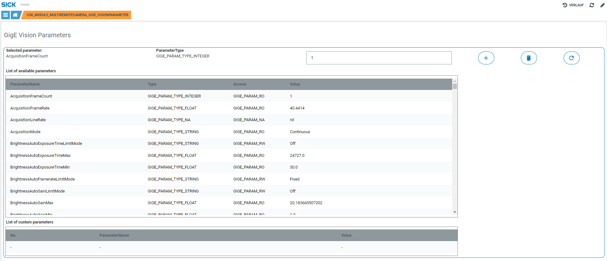

# CSK_Module_MultiRemoteCamera

Module to setup a single or multiple camera(s) connected to a SIM or SAE.  

  

## How to Run

The app includes an intuitive GUI to setup the camera(s).  
It requires a pico-/midiCam ver1 or ver2 or other GigE Vision compatible cameras.  
For further information check out the [documentation](https://raw.githack.com/SICKAppSpaceCodingStarterKit/CSK_Module_MultiRemoteCamera/main/CSK_Module_MultiRemoteCamera.html) in the folder "docu".

## Information

Tested on  

|Device|Firmware|Module version|
|--|--|--|
|SIM2x00|V1.8.0|V6.1.1|
|SIM2x00|V1.8.0|V6.1.0|
|SIM1012|V2.4.2|V6.1.0|
|SIM1012|V2.4.2|V6.0.0|
|SIM1012|V2.2.0|<V6.0.0|
|SIM2500|V1.3.0|<V6.0.0|
|SIM4000|V1.10.2|<V6.0.0|
|SICK AppEngine|V1.7.0|V6.0.0|
|SICK AppEngine|V1.3.2|<V6.0.0|

This module is part of the SICK AppSpace Coding Starter Kit developing approach.  
It is programmed in an object oriented way. Some of these modules use kind of "classes" in Lua to make it possible to reuse code / classes in other projects.  
In general it is not neccessary to code this way, but the architecture of this app can serve as a sample to be used especially for bigger projects and to make it easier to share code.  
Please check the [documentation](https://github.com/SICKAppSpaceCodingStarterKit/.github/blob/main/docu/SICKAppSpaceCodingStarterKit_Documentation.md) of CSK for further information.  

## Topics

Coding Starter Kit, CSK, Module, SICK-AppSpace, Multi, Camera, SIM, Image, 2D
